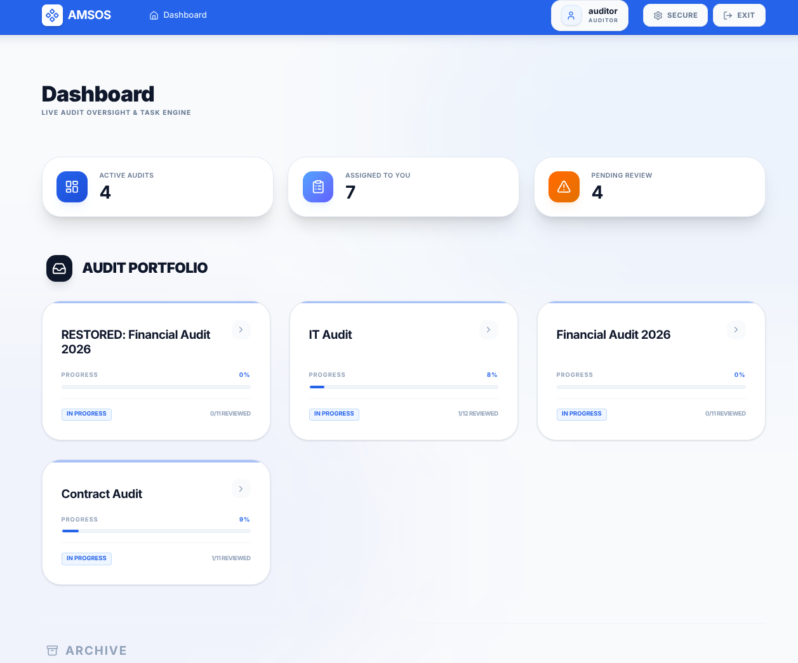
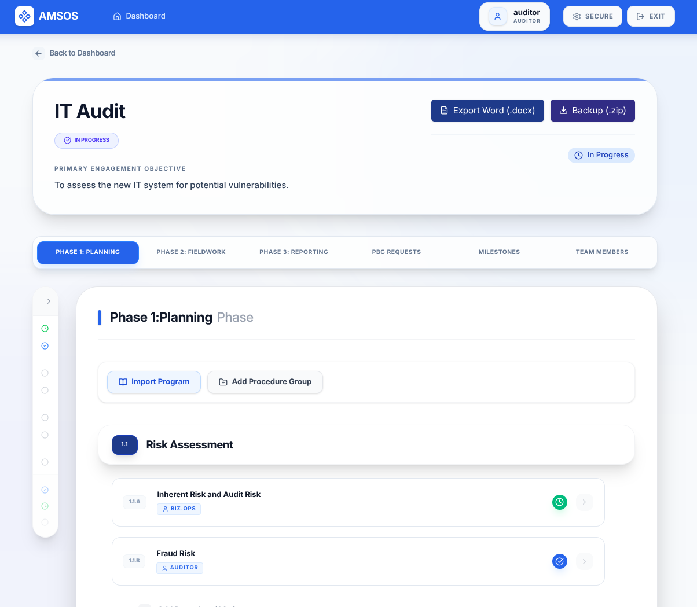
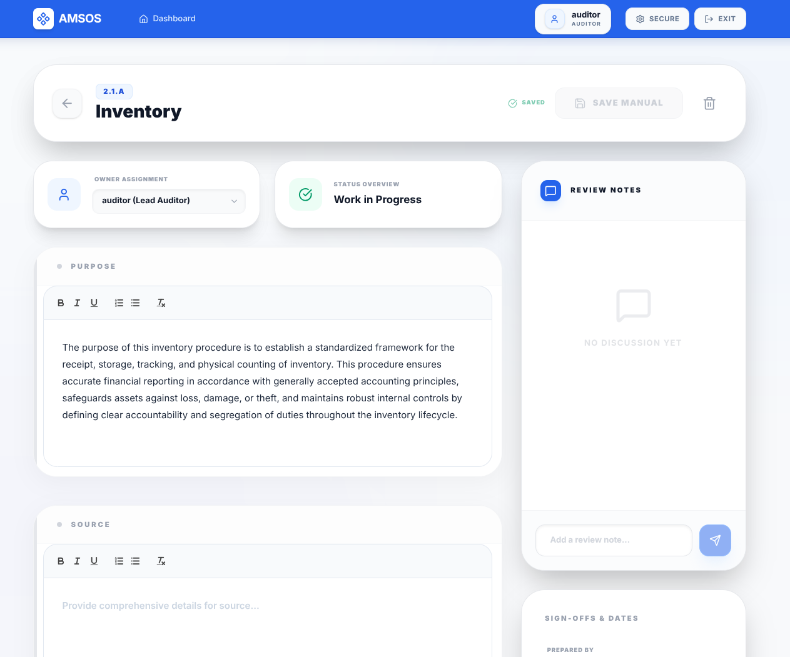

# AMSOS: Audit Management Software Open Source


*Central Dashboard providing a high-level overview of active audits, personalized assignments, and a Unified Task Engine.*

AMSOS is a simple, modern, and open-source web application designed for auditors to document audit programs and procedures. It streamlines the audit lifecycle across Planning, Fieldwork, and Reporting phases with built-in sign-off tracking, reviewer collaboration, and professional document export.

Deploy AMSOS on your terms with complete infrastructure-agnostic flexibility. Our open-source architecture gives you the freedom to run the platform locally for private testing, self-host it within your own secure network for maximum data sovereignty, or scale easily in the cloud. By leveraging a fully containerized design, AMSOS ensures that you always retain full ownership of your sensitive audit data, regardless of where you choose to host it.

## 🌟 Background & Mission

The purpose of this project is to provide free, open-source audit management software to audit offices. 

This software was "vibe-coded" by a CPA with 10 years of audit experience who was looking for a free, open-source alternative to expensive proprietary solutions. We believe that high-quality audit tools should be accessible to every auditor, regardless of budget.

**Contributions are welcomed!** Whether you are an auditor with feature ideas or a developer looking to help, please feel free to open an issue or submit a pull request.


*Audit Detail View featuring PBC tracking, milestone management, and phase-based procedure navigation.*

## 🚀 Key Features

*   **Unified Task Engine**: Personalized dashboard overview of active audits with high-impact analytics, including direct drill-downs into **"Assigned to You"** and **"Pending Review"** procedures.
*   **Three-Phase Workflow**: Standardized sections for Planning, Fieldwork, and Reporting with persistent tab navigation.
*   **Master-Detail Procedure Workspace**: Dedicated, high-performance workspace for documenting individual procedures, featuring a clean UI, rich text editing, and integrated discussion.
*   **Procedure Assignments**: Professional ownership management with a "Take Ownership" quick-action and delegated assignment dropdowns.
*   **PBC Tracking**: Centralize client information requests. **Upload and download a master PBC spreadsheet** to track status and ownership in one place.
*   **Audit Program Templates**: Create and manage a library of standard audit programs. Instantly import sets of procedures and purposes into any phase to standardize documentation and save time.
*   **Hierarchical Organization**: Organize procedures into **Procedure Groups** (e.g., "Payroll", "Revenue") with stable, automatic nomenclature.
*   **Smart Numbering**: Automatic professional nomenclature (Groups: **1.1**, Procedures: **1.1.a**, Attachments: **1.1.a.1**).
*   **Comprehensive Documentation**: Each procedure tracks Purpose, Source, Scope, Methodology, Results, Conclusions, and **Reviewer Comments**.
*   **Audit Sign-offs**: "Prepared By" and "Reviewed By" tracking with dates and visual status badges.
*   **Attachment Support**: Attach PDF, Word, Excel, and PowerPoint documents directly to specific procedures. 
*   **Attachment Review**: Each individual attachment now supports its own "Prepared By" and "Reviewed By" sign-offs for granular quality control.
*   **Milestone Tracking**: Monitor key project dates and **attach a detailed milestones spreadsheet** for granular project management.
*   **Team Management**: Document audit team members, roles, and contact information.
*   **Professional Export**: Generate a complete "Audit Program" in Word (.docx) format with one click, perfectly synchronized with your UI nomenclature.
*   **Secure Access**: Built-in authentication with granular role-based access control and **Federal SSO (OIDC)** support.


*Dedicated Procedure Workspace including standardized rich-text fields, ownership assignments, and integrated sign-off tracking.*

## 🔐 Roles & Permissions (RBAC)

AMSOS uses a granular **Role-Based Access Control (RBAC)** model to ensure data integrity and proper audit oversight. Access is controlled at two levels: system-wide roles and audit-specific team assignments.

### System Roles

| Role | Capabilities |
| :--- | :--- |
| **IT Administrator** | Identity Management. Can manage the user directory (add/import/delete users). Restricted from managing audit data. |
| **Business Operations** | Data Management. Can create/delete audits and manage the Audit Program Template Library. |
| **Audit Partner** | Senior management role. Can create, edit, and sign off on any audit they are assigned to. |
| **Audit Director** | Senior management role. Can create, edit, and sign off on any audit they are assigned to. |
| **Audit Manager** | Management role. Can create, edit, and sign off on any audit they are assigned to. |
| **Auditor** | Standard role. Can document procedures, upload attachments, and sign off as a preparer. |
| **Specialist** | Contributor role. Can document procedures but is **restricted from deleting procedures** to protect data integrity. |

### Audit Team Roles

While System Roles control application-wide permissions, the **Audit Team** assignment allows you to define specific functional roles within an individual project. These roles are for documentation and identification purposes and do not override system-level RBAC.

Key team roles include:
*   **Lead Auditor**: Primary contact and coordinator for the audit engagement.
*   **Quality Reviewer**: An independent reviewer (often from outside the immediate engagement team) who performs a final objective evaluation of the audit's significant judgments and conclusions.
*   **Staff/Senior Auditor**: Core team members responsible for fieldwork and procedure documentation.
*   **Specialist**: Subject matter experts (e.g., IT, Actuarial) providing focused support to the audit.

### Access Control Rules
*   **Audit Visibility**: Users (except Business Operations) can **only** see and access audits to which they have been explicitly added as a **Team Member**.
*   **Audit Deletion**: A safety-first approach restricts audit deletion strictly to the **Business Operations** role.
*   **Review Workflow**: While any role can be assigned to an audit, typically senior roles (Partner, Director, Manager) perform the final "Reviewed By" sign-off.
*   **Audit Logs**: All sensitive actions (logins, deletions, user changes) are tracked in the system-wide Audit Logs for compliance.

## 🛠 Tech Stack

*   **Framework**: [Next.js](https://nextjs.org/) (React)
*   **Database**: SQLite (via [Prisma ORM](https://www.prisma.io/))
*   **Styling**: Tailwind CSS
*   **Auth**: JWT-based session management + OpenID Connect (OIDC)
*   **Password Hashing**: [bcryptjs](https://www.npmjs.com/package/bcryptjs) (Cost Factor: 10)
*   **Export**: docx.js

## 👔 Business Readiness

AMSOS was built with the specific needs of **CPA Firms** and **Internal Audit Departments** in mind:

*   **Private Cloud Deployment**: Unlike standard SaaS, you can deploy AMSOS within your own Virtual Private Cloud (VPC), ensuring your sensitive client data never leaves your control.
*   **SQLite Portability**: Your entire database is a single file. This makes off-site backups, disaster recovery, and data archiving as simple as copying a folder.
*   **Audit Logging**: Every login and major record change is tracked to ensure accountability.
*   **No Vendor Lock-in**: As an open-source tool, you have full access to your data and the source code, protecting you from future fee increases or platform shutdowns.

## 🔒 Production Configuration

For production deployments, it is critical to secure the application with HTTPS and properly configure Single Sign-On (SSO) if required.

### 🌐 HTTPS & Reverse Proxy (Recommended)
AMSOS provides a streamlined way to deploy with HTTPS using a built-in Nginx reverse proxy configuration. This method handles SSL/TLS termination and automatically redirects insecure HTTP traffic to HTTPS.

#### Prerequisites
Before deploying with HTTPS, you must:
*   Have a domain name pointing to your server.
*   Obtain SSL certificates (e.g., via Let's Encrypt).
*   Create a `certs/` directory in the project root and place your certificate files there:
    *   `certs/fullchain.pem`
    *   `certs/privkey.pem`
    *   **Note**: Ensure the files are readable by the Docker container (e.g., `chmod 644 certs/*.pem`).

#### Deploy with HTTPS
Use the secure Docker Compose configuration:
```bash
docker compose -f docker-compose.secure.yml up -d --build
```
This command starts both the AMSOS application and an Nginx container. The application will be accessible only via HTTPS on port 443.

---

### 🔑 SSO (OIDC) Configuration
AMSOS supports any OpenID Connect (OIDC) compliant Identity Provider (IDP) such as Microsoft Entra ID (Azure AD), Okta, or Keycloak.

To enable SSO, configure the following environment variables in your `docker-compose.secure.yml` (or `docker-compose.prod.yml`) file:

| Variable | Description | Example |
| :--- | :--- | :--- |
| `NEXT_PUBLIC_BASE_URL` | The external URL of your AMSOS instance (used for redirect URIs). | `https://amsos.your-agency.gov` |
| `SSO_ISSUER_URL` | The base URL of your OIDC Identity Provider. | `https://login.microsoftonline.com/tenant-id/v2.0` |
| `SSO_CLIENT_ID` | The Client ID assigned to AMSOS by your IDP. | `00000000-0000-0000-0000-000000000000` |
| `SSO_CLIENT_SECRET` | The Client Secret assigned to AMSOS by your IDP. | `your-secure-client-secret` |

> **Note**: The current implementation assumes standard OIDC paths (`/auth` for authorization and `/token` for token exchange) relative to the `SSO_ISSUER_URL`. If your provider uses different paths (e.g., `/authorize`), you may need to adjust the endpoints in `src/app/api/auth/sso/login/route.ts`.

**Redirect URI**: In your IDP configuration, you must register the following callback URL:
`https://amsos.your-agency.gov/api/auth/sso/callback`

## 💾 Backup & Disaster Recovery

AMSOS provides robust data portability and recovery options:

1.  **Word Export**: For professional reporting and off-system review, click the **Export Word** button in any audit. This generates a grouped, professional document of all procedures.
2.  **Full System Backup**: To save the entire state of an audit (including all metadata and attachment files), use the **Backup Audit** button on the audit detail page. This generates a `.zip` file containing:
    *   `audit_data.json`: The complete structured data of the audit.
    *   `attachments/`: A folder containing the actual files (PDFs, Excel, etc.) associated with procedures.
3.  **Restore**: To restore an audit from a previous backup:
    *   Go to the **Main Dashboard**.
    *   Click the **Restore Backup** button (available to Business Operations users).
    *   Select the backup `.zip` file.
    *   A new audit will be created with the prefix `RESTORED:`, containing all original data and functional attachments.

## 💻 Installation & Deployment

AMSOS is designed for complete infrastructure-agnostic flexibility. Whether you are a solo practitioner or a large firm, choose the method that fits your IT environment.

### ✅ Prerequisites (Docker Methods)
To use the Docker methods below, you must have [Docker](https://www.docker.com/) installed on your server or local machine.

### 🐳 Method 1: Docker Compose (Recommended for Business & Cloud)
This is the professional standard for deploying AMSOS. Choose between a standard deployment (Port 3000) or a secure deployment (Port 443 with Nginx).

1.  **Clone & Configure**:
    ```bash
    git clone https://github.com/Bobby10105/AMSOS.git
    cd AMSOS
    ```
2.  **Edit Security**: Open your chosen compose file and replace `change-me-to-a-secure-random-string` with a secure random key for `JWT_SECRET`.
3.  **Launch**:

    *   **Option A: Standard (HTTP - Port 3000)**
        *Best for local testing or if you already have an external load balancer.*
        ```bash
        docker compose -f docker-compose.prod.yml up -d --build
        ```

    *   **Option B: Secure (HTTPS - Port 443)**
        *Best for direct production exposure. Requires SSL certificates in the `certs/` folder (see [Production Configuration](#-production-configuration)).*
        ```bash
        docker compose -f docker-compose.secure.yml up -d --build
        ```

---

### 🚀 Method 2: Docker Quickstart (Development & Evaluation)
Use this method for local evaluation or if you are a developer looking to contribute. This uses our development configuration with hot-reloading and debug logging enabled.

```bash
docker compose up --build
```
*Note: This command forces a fresh build of the container, synchronizes the database, and seeds initial data. It is optimized for a seamless developer experience.*

---

### 🛠 Method 3: Manual Installation (Node.js)
If you prefer to run AMSOS directly on your host machine or have a custom Windows Server environment without Docker.

#### 1. Prerequisites
*   [Node.js](https://nodejs.org/) (v18 or later)
*   npm (installed with Node.js)

#### 2. Setup
```bash
git clone https://github.com/Bobby10105/AMSOS.git
cd AMSOS
npm install
```

#### 3. Environment Configuration
Create a `.env` file in the root directory:
```bash
DATABASE_URL="file:./dev.db"
JWT_SECRET="your-secure-secret-key" # CHANGE THIS FOR PRODUCTION
```

#### 4. Database & Launch
```bash
npx prisma db push
npx prisma db seed
npm run build
npm run start
```

---

### 🔑 Initial Login
Once running, sign in with:
*   **IT Administrator**: `it.admin` / `admin`
*   **Business Operations**: `biz.ops` / `admin`

---
[License](LICENSE) | [Security Policy](SECURITY.md) | [Disclaimer](DISCLAIMER.md)
