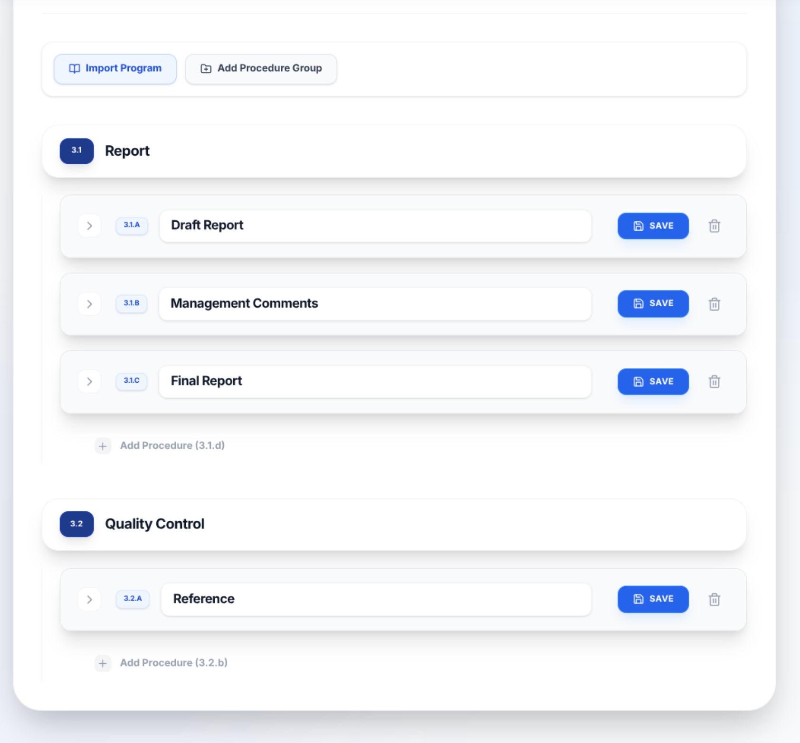
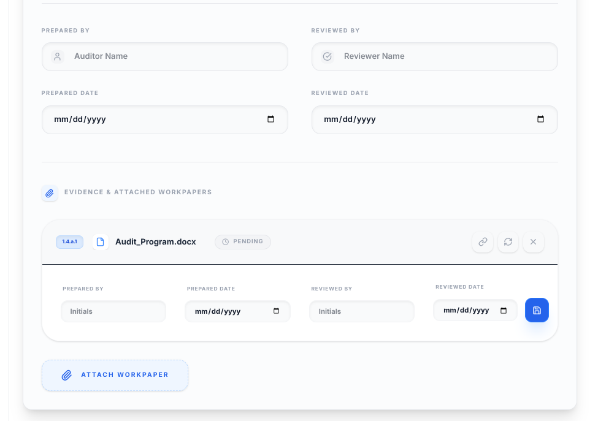
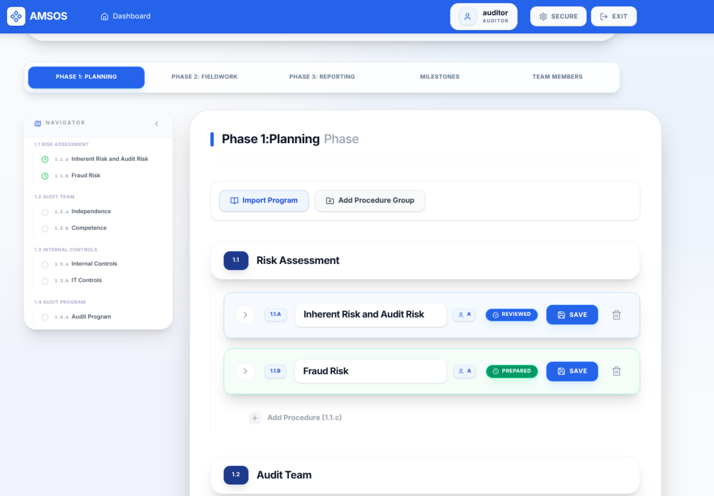

# AMSOS: Audit Management Software Open Source


*Central Dashboard providing a high-level overview of active audits, project status, and quick access to administrative tools.*

AMSOS is a simple, modern, and open-source web application designed for auditors to document audit programs and procedures. It streamlines the audit lifecycle across Planning, Fieldwork, and Reporting phases with built-in sign-off tracking, reviewer collaboration, and professional document export.

Deploy AMSOS on your terms with complete infrastructure-agnostic flexibility. Our open-source architecture gives you the freedom to run the platform locally for private testing, self-host it within your own secure network for maximum data sovereignty, or scale easily in the cloud. By leveraging a fully containerized design, AMSOS ensures that you always retain full ownership of your sensitive audit data, regardless of where you choose to host it.

## 🌟 Background & Mission

The purpose of this project is to provide free, open-source audit management software to audit offices. 

This software was "vibe-coded" by a CPA with 10 years of audit experience who was looking for a free, open-source alternative to expensive proprietary solutions. We believe that high-quality audit tools should be accessible to every auditor, regardless of budget.

**Contributions are welcomed!** Whether you are an auditor with feature ideas or a developer looking to help, please feel free to open an issue or submit a pull request.


*Audit Detail View featuring milestone tracking, team member assignments, and phase-based procedure navigation.*

## 🚀 Key Features

*   **Project Dashboard**: Overview of all active audits with a dedicated **Completed Archival** section for finished projects.
*   **Three-Phase Workflow**: Standardized sections for Planning, Fieldwork, and Reporting.
*   **Audit Program Templates**: Create and manage a library of standard audit programs. Instantly import sets of procedures and purposes into any phase to standardize documentation and save time.
*   **Hierarchical Organization**: Organize procedures into **Procedure Groups** (e.g., "Payroll", "Revenue"). 
*   **Smart Numbering**: Automatic professional nomenclature (Groups: **1.1**, Procedures: **1.1.a**, Attachments: **1.1.a.1**).
*   **Comprehensive Documentation**: Each procedure tracks Purpose, Source, Scope, Methodology, Results, Conclusions, and **Reviewer Comments**.
*   **Audit Sign-offs**: "Prepared By" and "Reviewed By" tracking with dates and visual status badges.
*   **Attachment Support**: Attach PDF, Word, Excel, and PowerPoint documents directly to specific procedures. 
*   **Attachment Review**: Each individual attachment now supports its own "Prepared By" and "Reviewed By" sign-offs for granular quality control.
*   **Milestone Tracking**: Monitor key project dates and **attach a detailed milestones spreadsheet** for granular project management.
*   **Team Management**: Document audit team members, roles, and contact information.
*   **Professional Export**: Generate a complete "Audit Program" in Word (.docx) format with one click.
*   **Secure Access**: Built-in authentication with granular role-based access control and **Federal SSO (OIDC)** support.


*Hierarchical Organization using Procedure Groups to categorize complex audit fieldwork into logical folders.*


*Detailed Procedure Documentation including standardized fields for audit evidence and integrated sign-off tracking.*

## 🔐 Roles & Permissions (RBAC)

AMSOS uses a granular **Role-Based Access Control (RBAC)** model to ensure data integrity and proper audit oversight. Access is controlled at two levels: system-wide roles and audit-specific team assignments.

### System Roles

| Role | Capabilities |
| :--- | :--- |
| **IT Administrator** | Identity Management. Can manage the user directory (add/import/delete users). Restricted from managing audit data. |
| **Business Operations** | Data Management. Can create/delete audits and manage the Audit Program Template Library. |
| **Audit Partner** | Senior management role. Can create, edit, and sign off on any audit they are assigned to. |
| **Audit Director** | Senior management role. Can create, edit, and sign off on any audit they are assigned to. |
| **Audit Manager** | Management role. Can create, edit, and sign off on any audit they are assigned to. |
| **Auditor** | Standard role. Can document procedures, upload attachments, and sign off as a preparer. |
| **Specialist** | Contributor role. Can document procedures but is **restricted from deleting procedures** to protect data integrity. |

### Audit Team Roles

While System Roles control application-wide permissions, the **Audit Team** assignment allows you to define specific functional roles within an individual project. These roles are for documentation and identification purposes and do not override system-level RBAC.

Key team roles include:
*   **Lead Auditor**: Primary contact and coordinator for the audit engagement.
*   **Quality Reviewer**: An independent reviewer (often from outside the immediate engagement team) who performs a final objective evaluation of the audit's significant judgments and conclusions.
*   **Staff/Senior Auditor**: Core team members responsible for fieldwork and procedure documentation.
*   **Specialist**: Subject matter experts (e.g., IT, Actuarial) providing focused support to the audit.

### Access Control Rules
*   **Audit Visibility**: Users (except Business Operations) can **only** see and access audits to which they have been explicitly added as a **Team Member**.
*   **Audit Deletion**: A safety-first approach restricts audit deletion strictly to the **Business Operations** role.
*   **Review Workflow**: While any role can be assigned to an audit, typically senior roles (Partner, Director, Manager) perform the final "Reviewed By" sign-off.
*   **Audit Logs**: All sensitive actions (logins, deletions, user changes) are tracked in the system-wide Audit Logs for compliance.


*Granular Control with individual "Prepared" and "Reviewed" sign-offs for every procedure and supporting attachment.*


*Visual Status Tracking providing immediate insight into preparation and review progress across all procedures.*

## 🛠 Tech Stack

*   **Framework**: [Next.js](https://nextjs.org/) (React)
*   **Database**: SQLite (via [Prisma ORM](https://www.prisma.io/))
*   **Styling**: Tailwind CSS
*   **Auth**: JWT-based session management + OpenID Connect (OIDC)
*   **Export**: docx.js


*Reviewer Collaboration Tools featuring real-time comments and secure file attachments for comprehensive workpaper support.*

## 💻 Installation & Deployment

AMSOS is designed for complete infrastructure-agnostic flexibility. Whether you are a solo practitioner or a large firm, choose the method that fits your IT environment.

### ✅ Prerequisites (Docker Methods)
To use the Docker methods below, you must have [Docker](https://www.docker.com/) installed on your server or local machine.

### 🐳 Method 1: Docker Compose (Recommended for Business & Cloud)
This is the professional standard for deploying AMSOS. It ensures a consistent environment, handles data persistence automatically, and is ready for your "Private Cloud" (AWS, Azure, GCP).

1.  **Clone & Configure**:
    ```bash
    git clone https://github.com/Bobby10105/AMSOS.git
    cd AMSOS
    ```
2.  **Edit Security**: Open `docker-compose.prod.yml` and replace `change-me-to-a-secure-random-string` with a secure random key for `JWT_SECRET`.
3.  **Launch**:
    ```bash
    docker compose -f docker-compose.prod.yml up -d --build
    ```

**Why this method?**
*   **Data Sovereignty**: Your audit data is stored in Docker volumes (`amsos-db` and `amsos-uploads`) on *your* infrastructure.
*   **Cloud Ready**: Easily deployable to any service that supports Docker (e.g., AWS Fargate, Azure Container Instances).
*   **Zero-Maintenance**: Automatically restarts if the server reboots (`restart: unless-stopped`).

---

### 🚀 Method 2: Docker Quickstart (Testing & Evaluation)
Use this if you just want to see how AMSOS works without long-term setup. This method uses our development configuration to get you up and running in seconds.

```bash
docker compose up --build
```
*Note: This runs in the foreground and is optimized for testing changes. Use Method 1 for actual audit fieldwork.*

---

### 🛠 Method 3: Manual Installation (Node.js)
If you prefer to run AMSOS directly on your host machine or have a custom Windows Server environment without Docker.

#### 1. Prerequisites
*   [Node.js](https://nodejs.org/) (v18 or later)
*   npm (installed with Node.js)

#### 2. Setup
```bash
git clone https://github.com/Bobby10105/AMSOS.git
cd AMSOS
npm install
```

#### 3. Environment Configuration
Create a `.env` file in the root directory:
```bash
DATABASE_URL="file:./dev.db"
JWT_SECRET="your-secure-secret-key" # CHANGE THIS FOR PRODUCTION
```

#### 4. Database & Launch
```bash
npx prisma db push
npx prisma db seed
npm run build
npm run start
```

---

### 🔑 Initial Login
Once running, sign in with:
*   **IT Administrator**: `it.admin` / `admin`
*   **Business Operations**: `biz.ops` / `admin`

**⚠️ Security Note:** Immediately change the passwords for these default accounts to secure your audit environment.

## 👔 Business Readiness

AMSOS was built with the specific needs of **CPA Firms
** and **Internal Audit Departments** in mind:

*   **Private Cloud Deployment**: Unlike standard SaaS, you can deploy AMSOS within your own Virtual Private Cloud (VPC), ensuring your sensitive client data never leaves your control.
*   **SQLite Portability**: Your entire database is a single file. This makes off-site backups, disaster recovery, and data archiving as simple as copying a folder.
*   **Audit Logging**: Every login and major record change is tracked to ensure accountability.
*   **No Vendor Lock-in**: As an open-source tool, you have full access to your data and the source code, protecting you from future fee increases or platform shutdowns.


#### 🔒 Reverse Proxy (Nginx)
For public access and SSL (HTTPS), use Nginx as a reverse proxy on port 80/443. A sample configuration:
```nginx
server {
    server_name your-app-url.gov;

    location / {
        proxy_pass http://localhost:3000;
        proxy_http_version 1.1;
        proxy_set_header Upgrade $http_upgrade;
        proxy_set_header Connection 'upgrade';
        proxy_set_header Host $host;
        proxy_cache_bypass $http_upgrade;
    }
    
    # Increase client body size for attachment uploads
    client_max_body_size 50M;
}
```

## 💻 Management

*   **Password Management**: Users can securely change their own passwords by clicking their profile icon in the navigation bar. **New users created by an IT Administrator are automatically forced to change their password upon their first login to ensure account security.**
*   **User Directory**: Accessible to all users to view the team, but only **IT Administrators** can add, delete, or bulk-import users via CSV.
*   **Audit Logging**: Key actions (Logins, Deletions, User Changes) are tracked in the system Audit Logs.
*   **Audit Deletion**: Restricted to the **Business Operations** role to prevent accidental data loss of official audit records.

## 📁 Project Structure

*   `/src/app`: Application routes, API endpoints, and SSO handlers.
*   `/src/components`: Reusable UI components (Procedures, Milestones, User Directory, etc.).
*   `/prisma`: Database schema and configuration.
*   `/public/uploads`: Local storage for audit procedure attachments.

## 🛡 Responsibility
**The user is solely responsible for the security, configuration, and proper deployment of this software.** 

The authors and contributors accept **no responsibility** for security incidents, data breaches, data loss, or system failures. Users must ensure:
*   **Environment Security**: Always change the `JWT_SECRET` and secure your `.env` file.
*   **Configuration**: Proper server, network, and database configuration is required for safe operation.
*   **SSL/TLS**: Production environments must be deployed behind a secure reverse proxy with HTTPS enabled.
*   **SSO Callback**: Ensure your Identity Provider (IDP) is configured with the correct callback URL: `https://your-domain.com/api/auth/sso/callback`.

Please review the full [Disclaimer](DISCLAIMER.md) before use.

---
[License](LICENSE) | [Security Policy](SECURITY.md) | [Disclaimer](DISCLAIMER.md)
